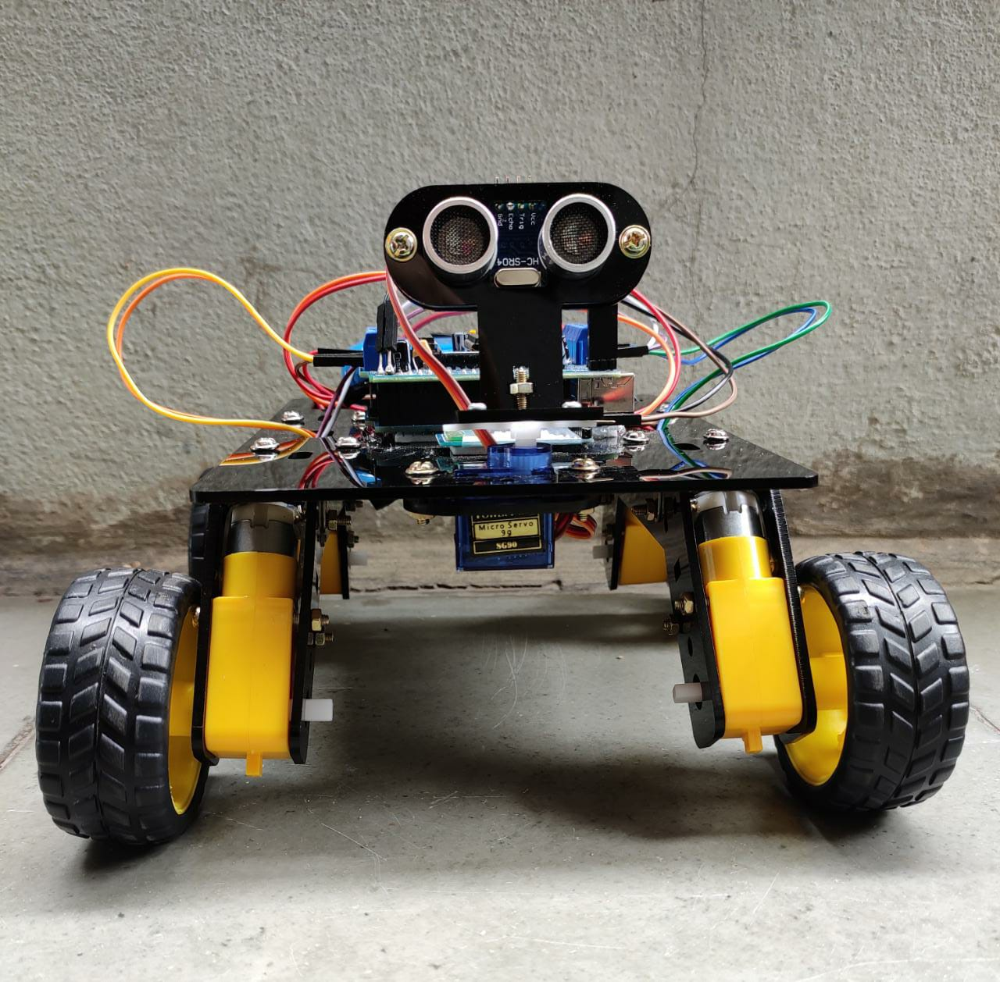
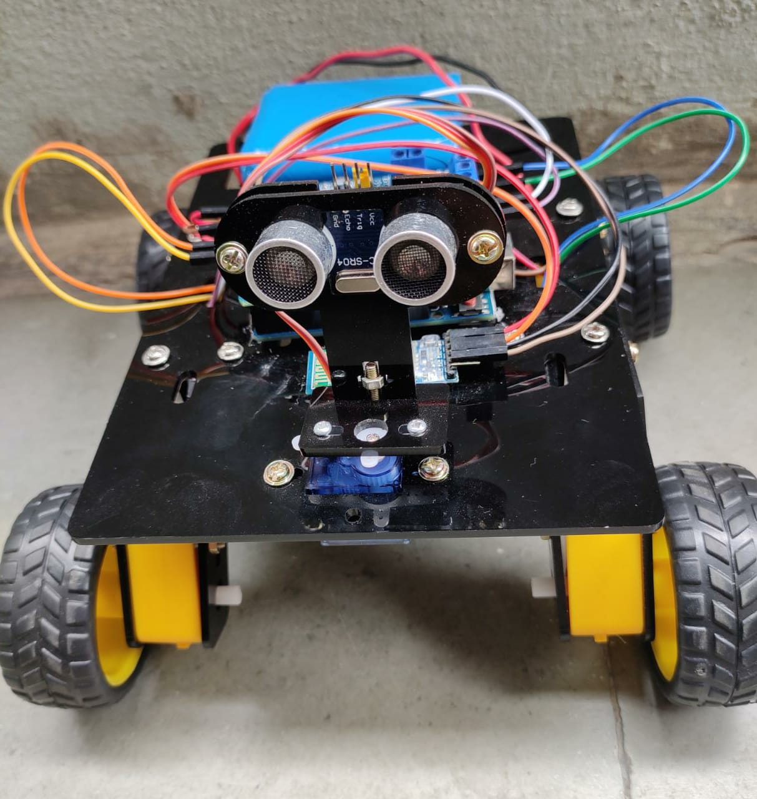
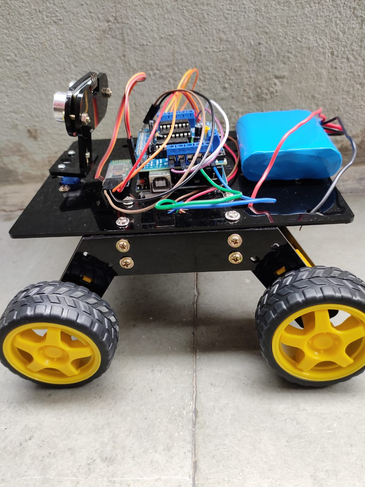

# VC-BOT
## Voice technology isn’t just a trend; it’s a paradigm shift!
VC BOT (Voice controlled BOT ) It is a BOT that is worked utilising wireless mode 
that is bluetooth by means of voice acknowledgment not at all like utilizing ordinary techniques, for example, 
catches ,motions and so forth. Here one can simply control their BOT with their android smartphone
making it move left ,right ,in reverse , forward and so on, controlling the bot with their brilliant 
phone makes it helpful and progressed as far as automation.Its a straightforward 
application where the android phone is utilized as the transmitting gadget and the 
bluetooth module mounted on the BOT is utilized as the collector.
  

