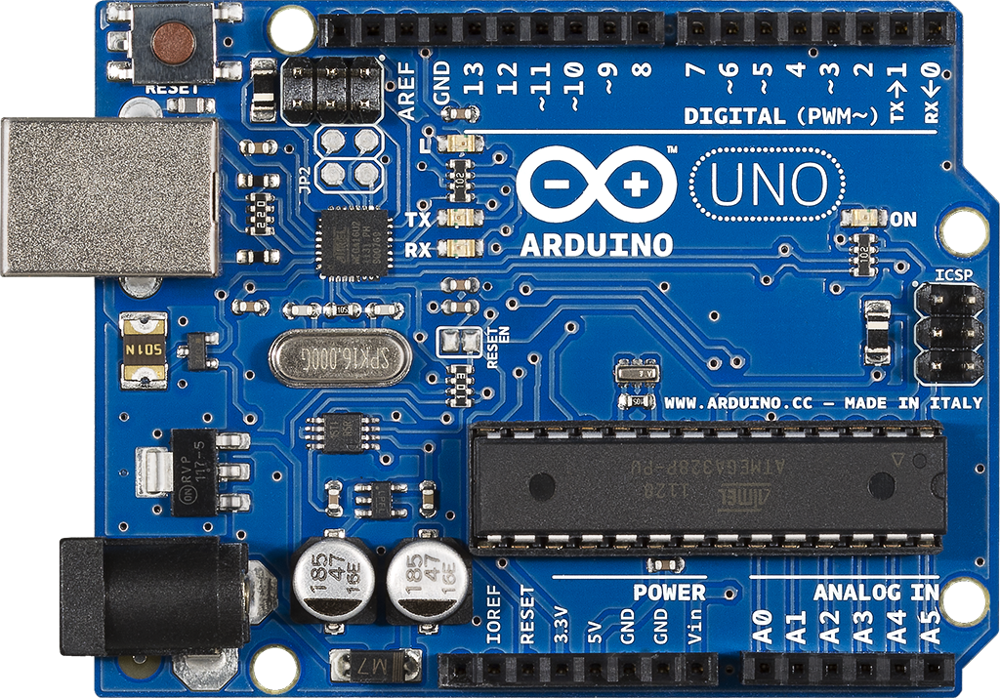
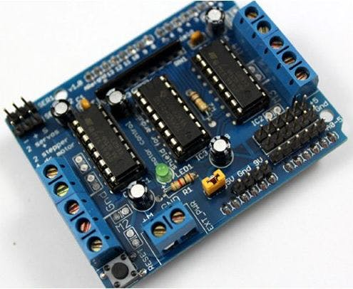
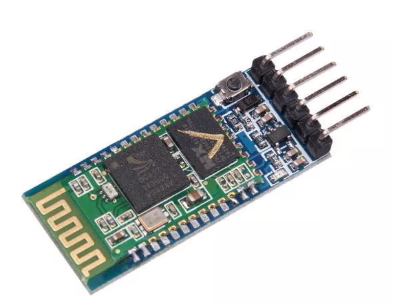
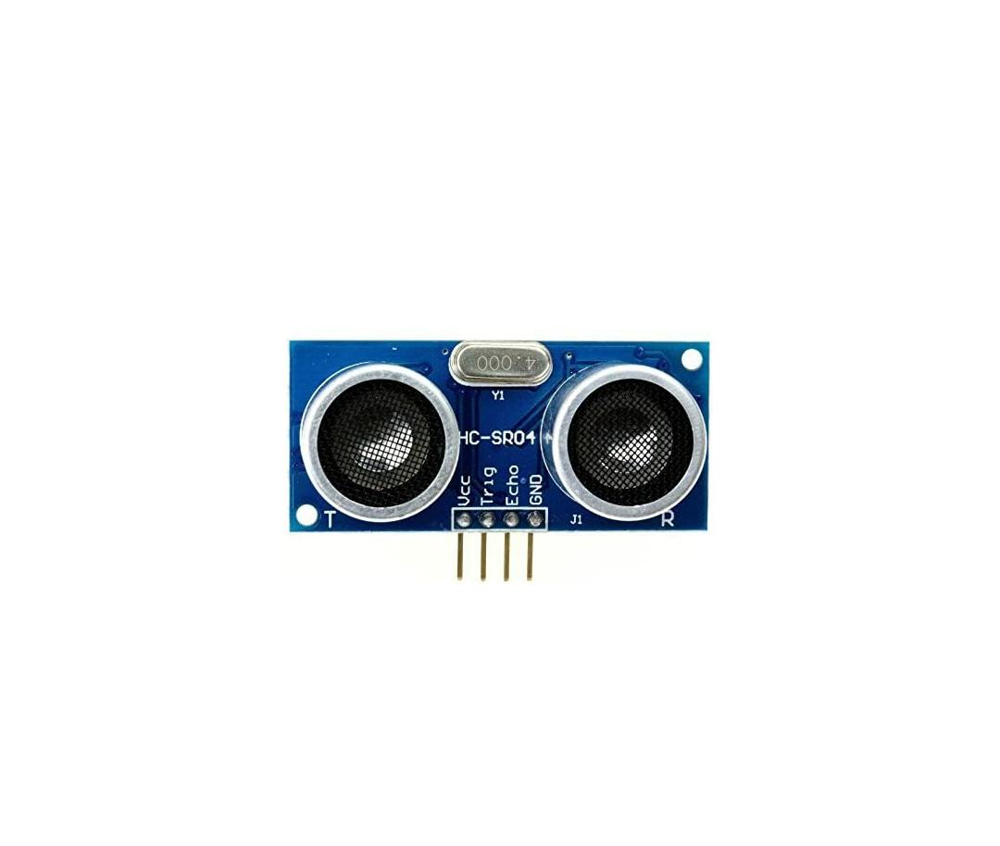
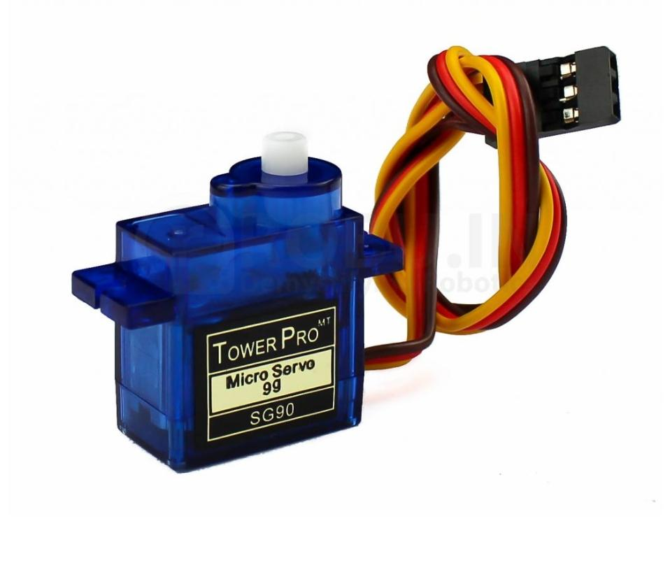
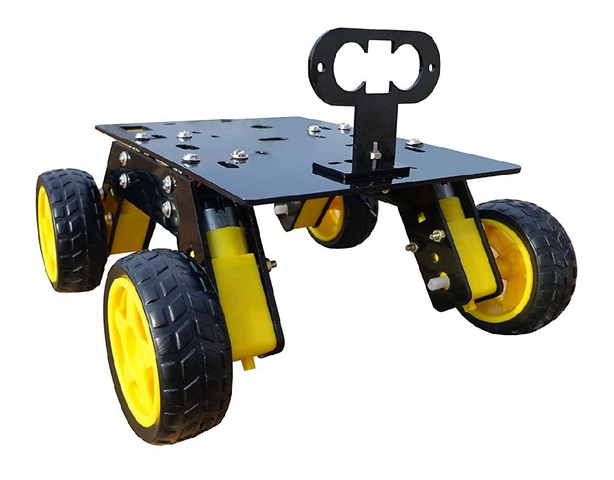
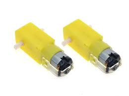
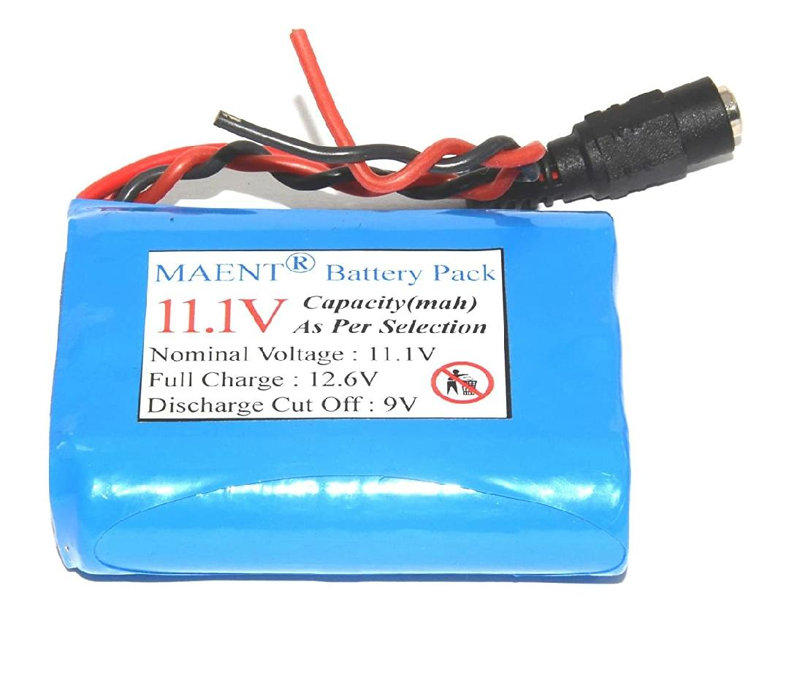
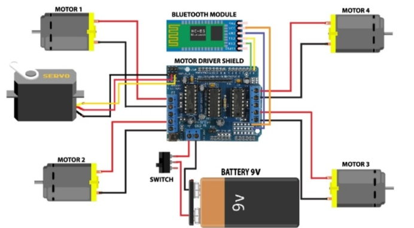

# VC-BOT
## Voice technology isn’t just a trend; it’s a paradigm shift!
VC BOT (Voice controlled BOT ) It is a BOT that is worked utilising wireless mode 
that is bluetooth by means of voice acknowledgment not at all like utilizing ordinary techniques, for example, 
catches ,motions and so forth. Here one can simply control their BOT with their android smartphone
making it move left ,right ,in reverse , forward and so on, controlling the bot with their brilliant 
phone makes it helpful and progressed as far as automation.Its a straightforward 
application where the android phone is utilized as the transmitting gadget and the 
bluetooth module mounted on the BOT is utilized as the collector.
  
# Hardware used:
## Arduino UNO
Arduino Uno is a microcontroller board based on the ATmega328P. It has 14 digital input/output pins (of which 6 can be used as PWM outputs), 6 analog inputs, a 16 MHz ceramic resonator (CSTCE16M0V53-R0), a USB connection, a power jack, an ICSP header and a reset button. It contains everything needed to support the microcontroller; simply connect it to a computer with a USB cable or power it with a AC-to-DC adapter or battery to get started.

## Arduino Motor shield 
The Adafruit Motor Shield is a great and quick way to control DC motors, servos or even stepper motors. It has the capability of controlling up to 2 stepper motors, 4 DC motors. and 2 servos.

## HC-05 Bluetooth Module
HC-05 Bluetooth Module is a simple Wireless Communication device based on the Bluetooth Protocol. 
Bluetooth Communication is a 2.4GHz frequency based RF Communication with a range of approximately 10 meters. It is one of the most popular and most frequently used low range communication for data transfer, audio systems, handsfree, computer peripherals etc.
The HC-05 Module supports for UART, USB as well as SPI communication and depending on the application, necessary pins can be used. 

## Ultrasonic sensor
As the name indicates, ultrasonic sensors measure distance by using ultrasonic waves. The sensor head emits an ultrasonic wave and receives the wave reflected back from the target. Ultrasonic Sensors measure the distance to the target by measuring the time between the emission and reception.

## Servo motor
A servo motor is an electrical device which can push or rotate an object with great precision. If you want to rotate and object at some specific angles or distance, then you use servo motor. It is just made up of simple motor which run through servo mechanism.

# Additional components:
## Car chasis

## Gear motor

## 12 v Lithium Battery

# Circuit Diagram
This is a pictorial represnetaion of the exact conections in the BOT.(here I have used 12v battery for proper functioning of the bot)

# Technologies used:
  Arduino UNO IDE
  Embedded C
# Working prototype:
  ### Link:https://youtu.be/n5clpXIrkrw
# Useful links:
  ### AMR Voice control app
  Uses android mobiles internal voice recognition to pass voice commands to your robot. Pairs with Bluetooth Serial Modules and sends in the recognized voice as a string. 
  #### Link:https://play.google.com/store/apps/details?id=robotspace.simplelabs.amr_voice&hl=en
  (one can also make there your own app to run this BOT).
  ### Adafruit Motor Shield library
  #### Link:https://www.arduinolibraries.info/libraries/adafruit-motor-shield-library
  # Conclusion:
This voice controlled BOT tends to have lot of real life application in the Medical and military feild. Not only that it can be used in various organistations for day to day   small purposes and in our houses as a pet.
   
 

